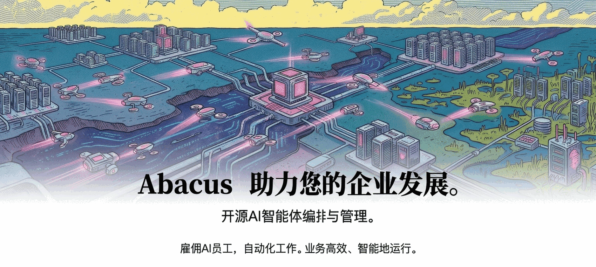

<p align="center">
  
</p>

<p align="center">
  <a href="#quickstart"><strong>快速开始</strong></a> &middot;
  <a href="docs/start/what-is-runeach.md"><strong>文档</strong></a> &middot;
  <a href="https://github.com/runeachai/runeach"><strong>GitHub</strong></a> &middot;
  <a href="https://discord.gg/m4HZY7xNG3"><strong>Discord</strong></a>
</p>

<p align="center">
  <a href="https://github.com/runeachai/runeach/blob/master/LICENSE"></a>
  <a href="https://github.com/runeachai/runeach/stargazers"></a>
  <a href="README.md"></a>
  <a href="https://discord.gg/m4HZY7xNG3"></a>
</p>

<br/>

<div align="center">
  <video src="https://github.com/user-attachments/assets/773bdfb2-6d1e-4e30-8c5f-3487d5b70c8f" width="600" controls></video>
</div>

<br/>

> 开源、自托管，为自治 AI 公司而生。

## RunEach 是什么？

# 面向自治 AI 公司的开源控制平面

**如果 OpenClaw 是员工，RunEach 就是公司。**

RunEach 是一个 Node.js 后端和 React 控制面板，用来把分散的 AI 代理组织成真正可运营的公司。你可以在这里定义公司目标、搭建组织架构、分配任务、触发心跳、设置预算与治理边界，并在一个控制台里持续掌握执行进度、成本和风险。

它看起来像任务管理系统，但本质上更接近自治 AI 公司的操作系统。公司是一级对象，所有工作都沿着目标、项目、工单和组织架构流动。

**管理公司目标，而不是一堆终端、脚本和 PR。**

|        | 步骤     | 示例                                                                 |
| ------ | -------- | -------------------------------------------------------------------- |
| **01** | 定义目标 | _“把 AI 笔记产品做到品类第一，并尽快跑出可持续营收。”_               |
| **02** | 组建团队 | CEO、CTO、工程师、设计师、市场负责人，任何代理、任何运行时都能接入。 |
| **03** | 审批运行 | 审核策略、设置预算、放行执行，然后在控制台里持续观察整家公司。       |

<br/>

> **即将推出：RunEachHub** — 一个统一的发现、发布与安装中心。浏览预置的公司模板、组织结构、代理配置与技能包，把成熟的 AI 公司能力直接导入你的 RunEach 实例。

<br/>

<div align="center">
<table>
  <tr>
    <td align="center"><strong>兼容<br/>代理</strong></td>
    <td align="center"><br/><sub>OpenClaw</sub></td>
    <td align="center"><br/><sub>Claude Code</sub></td>
    <td align="center"><br/><sub>Codex</sub></td>
    <td align="center"><br/><sub>CodeBuddy</sub></td>
    <td align="center"><br/><sub>Cursor</sub></td>
    <td align="center"><br/><sub>Bash</sub></td>
    <td align="center"><br/><sub>HTTP</sub></td>
  </tr>
</table>

<em>只要能接收心跳，就能进入你的组织结构。</em>

</div>

<br/>

## 你适合用 RunEach，如果你……

- ✅ 想打造真正能长期运转的自治 AI 公司，而不是一次性的代理实验
- ✅ 需要把多种不同代理（OpenClaw、Claude Code、Codex、CodeBuddy、Cursor）收束到同一个经营目标下
- ✅ 同时开着很多代理终端，却很难知道谁在做什么、为什么做、做到了哪一步
- ✅ 想让代理 24/7 自主运行，但仍然保留审计、审批和人工介入能力
- ✅ 想把成本、预算和治理边界放进同一个控制面板，而不是靠人肉盯账单
- ✅ 想让代理协作过程更像经营一家公司，而不是维护一堆分散的脚本和工作流
- ✅ 想在桌面端和移动端都能掌握公司当前状态

<br/>

## 核心特性

<table>
<tr>
<td align="center" width="33%">
<h3>🔌 自由接入现有代理</h3>
接入你现有的代理体系。任何代理、任何运行时，都可以纳入同一张组织架构图。
</td>
<td align="center" width="33%">
<h3>🎯 目标对齐</h3>
每个任务都能追溯回公司目标。代理不只知道要做什么，也知道为什么现在要做这件事。
</td>
<td align="center" width="33%">
<h3>💓 心跳驱动</h3>
用计划心跳和事件触发唤醒代理，让任务在组织结构中持续流转和升级。
</td>
</tr>
<tr>
<td align="center">
<h3>💰 成本控制</h3>
为每个代理设置月度预算，实时记录成本，触达硬上限时自动停止，避免失控烧钱。
</td>
<td align="center">
<h3>🏢 多公司隔离</h3>
一套部署，多家公司，数据严格隔离。用同一控制平面管理整个 AI 公司组合。
</td>
<td align="center">
<h3>🎫 工单与审计</h3>
把工作沉淀为工单、评论和活动日志，确保每个决策、每次执行都有迹可循。
</td>
</tr>
<tr>
<td align="center">
<h3>🛡️ 治理与审批</h3>
你就是董事会。审批招聘、覆盖策略、暂停或终止任何代理，都有明确控制点和审计记录。
</td>
<td align="center">
<h3>📊 组织架构</h3>
角色、汇报关系、职责边界全部显式建模，让代理协作像真正的公司，而不是群聊。
</td>
<td align="center">
<h3>📱 移动端可管控</h3>
无论在办公室还是路上，你都能随时查看公司运行状态并做出干预。
</td>
</tr>
</table>

<br/>

## RunEach 解决的痛点

| 没有 RunEach 时                                                                                     | 使用 RunEach 之后                                                                                               |
| -------------------------------------------------------------------------------------------------- | -------------------------------------------------------------------------------------------------------------- |
| ❌ 你开着一堆代理终端，却说不清谁在做什么、是否撞车、为什么这件事重要。                           | ✅ 所有工作都挂在工单、项目、目标和组织架构之下，进度、责任和上下文一目了然。                                 |
| ❌ 你得反复给代理补上下文，重新解释业务背景、优先级和目标链路。                                   | ✅ 上下文沿着任务链路自然传递，代理能同时看到当前工作和它服务的更大目标。                                     |
| ❌ 代理配置、脚本和触发器散落在各处，协作靠约定俗成，治理靠运气。                                 | ✅ RunEach 原生提供组织架构、工单流转、心跳调度、审批和活动审计，把公司运营变成可管理系统。                    |
| ❌ 一次失控循环就可能烧掉大量 token，等你发现时，预算和额度都已经没了。                           | ✅ 成本与预算内建进控制平面，软提醒和硬上限同时存在，花费可见、可控、可暂停。                                 |
| ❌ 周期性工作要靠人手动盯，常驻代理和临时任务之间也缺少统一调度。                                 | ✅ 心跳和事件触发共同驱动日常运营，让周期性工作、即时任务和审批节奏进入同一套体系。                           |
| ❌ 一个新想法从“想到”到“真正交给代理跑起来”之间，往往要跨越多个工具和大量手工衔接。               | ✅ 直接在 RunEach 里创建任务、指定责任人、查看结果，把启动、执行、审查和追踪收敛到一个控制台。                |

<br/>

## 为什么 RunEach 不一样

RunEach 把自治 AI 公司真正需要的控制面细节做对了。

|                      |                                                                                                 |
| -------------------- | ----------------------------------------------------------------------------------------------- |
| **原子化执行**       | 任务检出和预算约束是原子操作，避免重复开工、并发冲突和失控支出。                               |
| **会话状态延续**     | 代理在多次心跳之间延续任务上下文，而不是每轮都从零开始重新进入工作状态。                       |
| **运行时技能注入**   | 代理可以在运行时接收工作流知识和项目上下文，不需要为了接入控制平面重写整套能力。               |
| **治理可审计可回滚** | 审批卡点、配置变更、关键动作都有记录，出问题时可以定位、复盘并安全回退。                       |
| **目标链路完整**     | 任务自带完整的目标祖先链，让代理始终理解“为什么是现在、为什么是这件事”。                       |
| **公司模板可移植**   | 公司结构、代理配置和技能可导入导出，且能处理密钥脱敏和命名冲突。                               |
| **多公司严格隔离**   | 所有业务实体都归属于公司，单个部署即可承载多个 AI 公司，同时保留清晰的数据与审计边界。         |

<br/>

## RunEach 不是什么

|                      |                                                                                                 |
| -------------------- | ----------------------------------------------------------------------------------------------- |
| **不是聊天机器人**   | RunEach 的核心不是“陪你聊天”，而是帮助一家公司规模的 AI 代理体系持续运转。                      |
| **不是代理框架**     | 我们不规定你怎么造代理；我们定义的是怎样把现有代理组织起来、治理起来、运营起来。              |
| **不是工作流搭建器** | 没有拖拽式流水线编排。RunEach 建模的是公司：目标、组织架构、预算、治理和执行闭环。              |
| **不是 Prompt 仓库** | 提示词、模型、运行时由代理自己决定；RunEach 管的是这些代理所在的组织与工作系统。                |
| **不是单代理工具**   | 如果你只有一个代理，也许还不需要它；如果你在经营一支 AI 团队，它会立刻变得重要。               |
| **不是代码审查工具** | RunEach 负责编排工作，不负责替代你的 PR 审查流程；你可以把现有工程工具链接进来继续使用。        |

<br/>

<a id="quickstart"></a>

## 快速开始

开源，自托管，不需要注册 RunEach 账号。

```bash
npx @runeachai/runeach onboard --yes
```

或手动从源码启动：

```bash
git clone https://github.com/runeachai/runeach.git
cd runeach
pnpm install
pnpm dev
```

这会在 `http://localhost:3100` 启动 API 和控制台。未设置 `DATABASE_URL` 时，RunEach 会自动使用内置 PostgreSQL，无需额外数据库准备。

> **环境要求：** Node.js 20+，pnpm 9.15+

### 桌面预览（Windows 优先）

启动本地 Electron 桌面壳：

```bash
pnpm desktop:dev
```

常用覆盖参数：

```bash
RUNEACH_HOME=/custom/desktop-home PORT=3210 pnpm desktop:dev
```

运行桌面端 smoke 检查：

```bash
pnpm smoke:desktop
```

<br/>

## 常见问题

**典型部署方式是什么？**  
本地开发时，一个 Node.js 进程会管理嵌入式 PostgreSQL 和本地文件存储。生产环境可以直接接入你自己的 Postgres，并按自己的基础设施方式部署。配置好公司、项目、目标和代理后，剩下的执行由代理体系自己推进。

如果你是独立开发者，也可以先通过 Tailscale 等方式把本地 RunEach 暴露给自己使用，后续再迁移到云环境。

**能同时运行多家公司吗？**  
可以。单个部署可以运行任意数量的公司，并保持严格的数据隔离。

**RunEach 和 OpenClaw、Claude Code、Codex、CodeBuddy 这类代理工具有什么区别？**  
RunEach 不替代这些代理，它把它们编排成一家公司。组织架构、预算、目标、治理、审批和可追踪性，才是 RunEach 提供的核心能力。

**为什么不直接把 OpenClaw 接到 Asana 或 Trello？**  
自治代理协作不仅是“有个任务板”这么简单，还涉及任务检出、会话延续、预算约束、审批治理和执行审计。RunEach 把这些控制平面的细节做成了一套系统，而不是让你自己拼装。

（支持接入自定义工单系统仍在路线图中。）

**代理会持续运行吗？**  
默认情况下，代理会在计划心跳和事件触发（例如任务分配、@ 提及）时运行。你也可以接入像 OpenClaw 这样的常驻代理。你负责带来代理，RunEach 负责协调它们的工作。

<br/>

## 开发

```bash
pnpm dev              # 完整开发模式（API + UI，watch 模式）
pnpm dev:once         # 完整开发模式（不启用文件监听）
pnpm dev:server       # 仅启动服务端
pnpm build            # 全量构建
pnpm typecheck        # 类型检查
pnpm test:run         # 运行测试
pnpm db:generate      # 生成数据库迁移
pnpm db:migrate       # 应用迁移
```

完整开发文档见 [doc/DEVELOPING.md](doc/DEVELOPING.md)。

<br/>

## 路线图

- ⚪ 优化 OpenClaw 的接入体验
- ⚪ 支持更多云端代理场景，例如 Cursor / e2b agents
- ⚪ RunEachHub — 发现、发布并安装整套 AI 公司模板
- ⚪ 继续简化代理配置与新手引导
- ⚪ 增强插件生态与官方插件能力（知识库、自定义追踪、队列等）
- ⚪ 更好的 harness engineering 支持
- ⚪ 完善文档与教程

<br/>

## 贡献

欢迎贡献。详见 [CONTRIBUTING.md](CONTRIBUTING.md)。

<br/>

## 社区

- [Discord](https://discord.gg/m4HZY7xNG3) — 加入社区
- [GitHub Issues](https://github.com/runeachai/runeach/issues) — 报 bug 和功能请求
- [GitHub Discussions](https://github.com/runeachai/runeach/discussions) — 想法和 RFC

<br/>

## 许可证

MIT &copy; 2026 RunEach

## Star 历史

[](https://www.star-history.com/?repos=runeachai%2Fruneach&type=date&legend=top-left)

<br/>

---

<p align="center">
  
</p>

<p align="center">
  <sub>MIT 开源。为那些真正想经营 AI 公司的人而设计。</sub>
</p>
